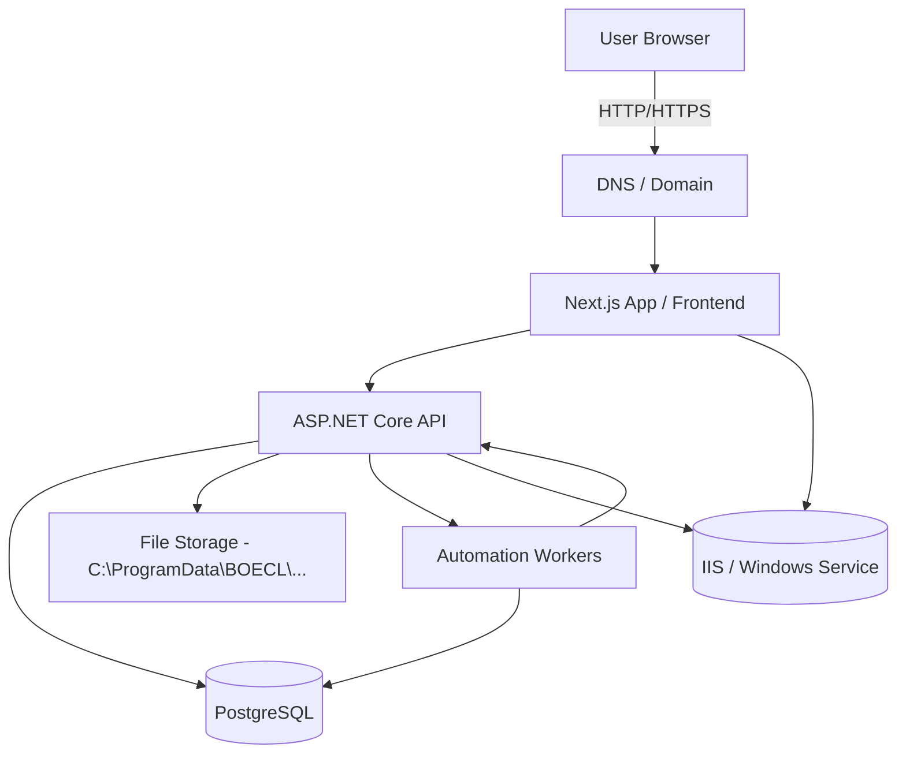

# BOECL Architecture

## Stack

- Frontend: Next.js App Router (`apps/web`) using React and TypeScript.
- Backend: ASP.NET Core (`apps/api`) endpoint-based API.
- Database: PostgreSQL with EF Core/Npgsql.
- Infra: Windows Server + IIS + reverse proxy setup.
- Auth: ASP.NET Core Identity, cookies, CSRF, anti-forgery token flow.
- Background processing: `IHostedService` workers and Windows scheduled jobs.

## Backend components

- Identity + roles: Owner/Admin/Editor/Author/Translator/SEO.
- Authorization: policy-based endpoint guards.
- Content model: article groups, localized localizations, taxonomy, media, categories/tags, sources.
- Automation endpoints: ready-content workflow, visual candidate checks, translations/status updates.

## Frontend components

- Localized routes: `/{locale}/...`
- Admin workspace grouped into feature modules.
- Public routes with locale-aware metadata and noindex behavior for protected pages.
- SEO metadata generation with canonical and locale alternatives.

## Data flow

1. Editor creates/edits localized content in API-backed admin.
2. Workflow gates determine publication state.
3. Public API exposes only published locales.
4. Frontend renders content by locale and route.
5. Automation workers can generate support content and evidence records.

## API structure

- Route mapping done by endpoint registrations in API startup.
- Endpoints grouped by purpose: public, editorial, automation, traffic, media, status.
- JSON API contracts with locale and status filters on content.

## Authentication and authorization

- Cookie-based auth with user context.
- Role checks at endpoint and action level.
- CSRF required for state-changing operations.
- Password policy and security-stamp-aware session invalidation.

## Storage

- No S3-compatible object storage in current production design.
- Media files are stored on local filesystem paths under `%ProgramData%` fallback to shared folder locations.
- Static serving path is mediated by API media endpoints.

## Deployment model

- Windows service hosts Next.js site (`PeletnapechkaiWeb`, `BoeclStagingWeb`).
- IIS hosts API and reverse-proxies to frontend services.

## External integrations

- Google Search Console OAuth + dashboard endpoints
- Optional analytics: GA/Clarity
- Optional ad integrations and index submission flow
- Optional email and push providers based on runtime configuration

## Multi-region / i18n

- Locale route and locale-aware taxonomy currently supported.
- `tr-TR` is used as default editorial baseline.
- No automatic fallback to unrelated locales for published content.

## Operational safeguards

- Health scripts and deployment journal.
- Background task monitoring and continuity scripts.
- Recovery scripts and backup/restore support.